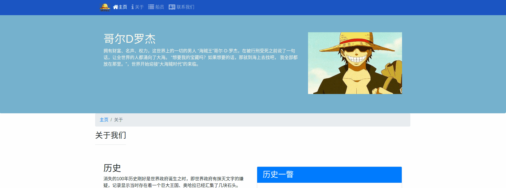
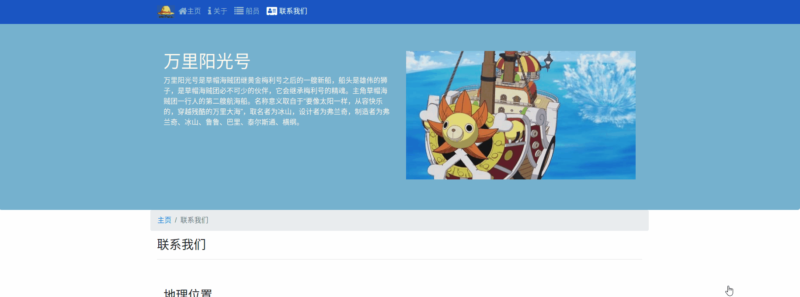

## OnePiece

### 一个主要使用Bootstrap4搭建的静态网站,内容都是跟海贼王相关的,也用到一个AOS过渡工具,其Github地址是https://github.com/michalsnik/aos

### 首页是这样

### 关于页面

### 船员页面

### 联系页面

### 小结

本项目主要用于了解Bootstrap4的基本使用,加深对Grid系统等使用的理解.